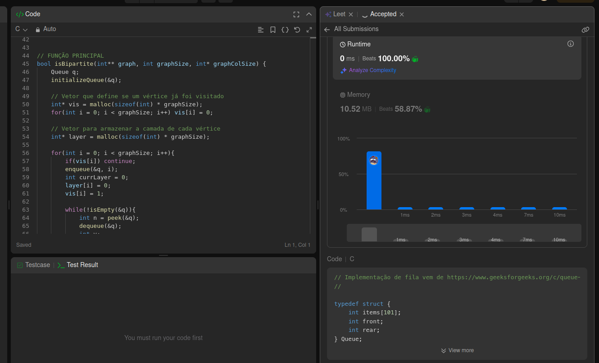
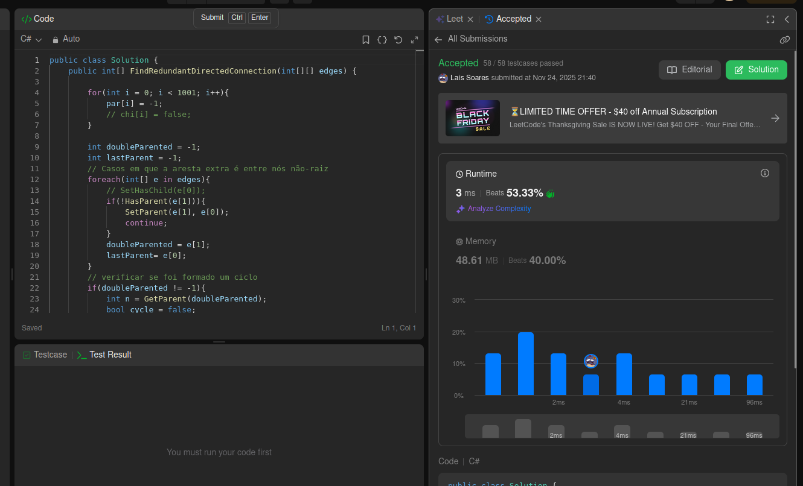

## Link ao vídeo de apresentação do trabalho:

## Alunos  
| Matrícula | Nome |  
|-----------------------|---------------------|  
| 211029512 | Laís Cecília Soares Paes |  
| 202017129 | Rodrigo de Andrade Lima Orlandi |  

## Questões
| Fonte | Questão | Dificuldade | Autor |
|-------|---------|-------------|-------|
| LeetCode| [785 - Is Graph Bipartite?](https://leetcode.com/problems/is-graph-bipartite/description/) | Médio | Laís
| LeetCode| [685 - Redundant Connection II](https://leetcode.com/problems/redundant-connection-ii/description/) | Difícil | Laís
| Beecrowd| [1270 - Fibra Óptica](https://judge.beecrowd.com/pt/problems/view/1270) | Difícil | Rodrigo

## Screenshots

### Is Graph Bipartite?

### Redundant Connection II

### Fibra Óptica

